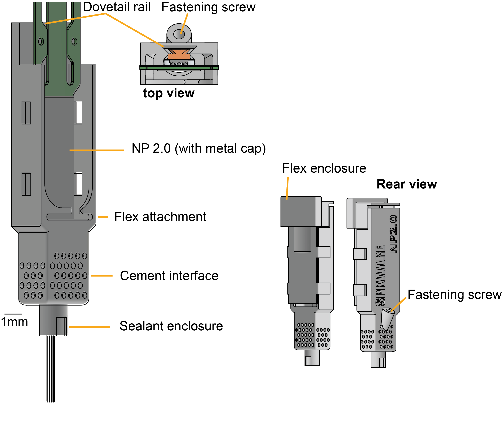

# chronic_holder

Design files and instructions for manufacturing NP1.0, NP2.0alpha, and NP2.0 Neuropixels chronic recording enclosures.

**Please reach out to us if you want to try this approach, we need your input.** We are actively working on the instructions and trying to find vendors that can print holders reliably.

These probe enclosures use the dovetail to secure the probes, the design is at the *current limit of the printing resolution of the SLA technology* and for that reason, it is sensitive to the material, and to the washing and curing steps. After printing, the screw hole has to be taped using a standard 1mm taper.

The NP 1.0 holder weights 1.2g, the NP2.0 holder weights 0.57g. All weights include the respective probe, chassis and cap without headstage.

#### Printing

**You may have to adjust the tolerances depending on the printing and washing protocol you use**, we provide scripts - iLogic - to do this programatically from **Autodesk Inventor**. Do not implant probes without testing the tolerances. We tipically print an array of differenet tolerance values to find out the one that fits best, then use that tolerance for all holders. 

We used a **FormLabs Form 3+ printer** and **GreyPro resin** to develop these protocols, please let us know if you use another printer or resin.

Each version NP1.0, NP2.0 and NP2.0alpha has a folder in the repository. Print using the files in the **stl_exports** folder and using PreForm (we will provide files to print directly in the future; for now feel free to reachout to us for these files).

     -  the **main chassis** is printed standing **vertically** and with the **dovetail side facing the mixer**, we tested other orientations, this was the most reliable. Do not use internal supports nor supports in the dovetail rail. This part is very sensitive to the location of the supports and printing orientation.
     - we print the *cap* (with and without headstage)  and the *stereotax holder* parts at an angle with the outer part facing the bottom, no internal supports.

#### Mounting probes

#### Recovering probes

## Tools list
The following lab tools are required to assemble and implant a probe holder.

- solder station
- forceps (for probe handling)
- small phillips screwdriver
- hex key (TODO: add size)
- putty to hold probes when not in use (link)
- Kopf surgical stereotax (we will soon make stereotax arm attachments for other manufactures) TODO: more stereotax details?
- Standard rodent surgical tool set
- Thorlabs posts and connectors are helpful for washing probes, but using the sterotax is also fine if not needed for other surgeries
- The Imec acute recording post (the one that's meant to go with the dovetail) is also helpful for washing the probes
- Tap Wrench
- Size M1 tap

If 3D printing parts in-house:
- Formlabs Form 3+ printer
- Form Wash
- Form Cure
- Resin Tank
- Grey Pro resin
- Isopropanol

|       |  command     | description |
|-------|--------------|-------------|
| ``-w``| ``--wait``   | start with software trigger OFF |

## Parts list (non-printed)
The following parts are required to assemble and implante one probe holder. (requirements are the same for all probe versions).
- 1x Neuropixels 1.0/2.0/2.0alpha probe (with metal cap. Metal caps (dovetails) can also be glued on in house, but alignment may not be as good.)
- 1x set screw (TODO: M1x3 or M1x4?)
- 1x nut (TODO: details for stereotax nut)
- 1x bolt (TODO: details for stereotax stereotax bolt)
- silver wire (TODO: link)
- Kapton tape (thin, for soldering ground wire)
- 

## Parts list (3D-printed)
-TODO: add parts

## Manufacturing
Parts should be printed on a FormLabs resin printer with Grey Pro resin. We have found this resin to have the best material properties for chronic recordings. Other brands may work but are untested. 

*Clear*, and *Rigid 10k*, will NOT work (too brittle). Black V2 also worked in our hands but was not as good.

TODO: add print settings, add wash and cure instructions, add recommmended print manufacturer

## Surgical Implantation

